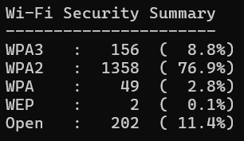

# Wardriving-Wireless-Security-Analysis

## 📌 Project Overview

This project analyzes Wi-Fi networks collected via wardriving using Kismet, with a strong focus on ethical data handling and anonymization.
The goal is to demonstrate practical skills in wireless security assessment, data anonymization, Python scripting, and visualization, suitable for IT Security / SOC Analyst roles.

All collected data is anonymized before analysis and no raw or identifying data is published.

### Demo:

### Live Map:
👉 https://xxxxxx/

## 🎯 Objectives

- Collect Wi-Fi metadata using Kismet during wardriving
- Anonymize all sensitive identifiers (SSID, BSSID, manufacturer, signal strength)
- Visualize anonymized data on an interactive map
- Summarize Wi-Fi security posture in the scanned area
- Follow ethical, legal, and responsible disclosure principles

## 🧰 Tools & Technologies

- Kismet – Wi-Fi packet capture and wardriving
- Python 3
 -SQLite (Kismet .kismet database format)
- Folium / Leaflet.js – interactive mapping
- Hashing (SHA-256 + salt) for anonymization

## 🔐 Data Anonymization & Ethics

This project does not publish raw wardriving data.

The following steps are applied before any analysis:

- SSIDs are hashed using SHA-256 with a random user-defined salt
- BSSIDs (MAC addresses) are hashed
- GPS coordinates are rounded (to the third decimal)
- Signal strength is removed
- Manufacturers are replaced with fictional company names
- Timestamps are removed

⚠️ Raw Kismet capture files are intentionally excluded from this repository.

## 📊 Scan Results and Analysis

Key Observations

- The majority of networks use WPA2, indicating reasonable but aging security
- WPA3 adoption is still low
- A notable percentage of open networks, including IoT devices
- Legacy protocols (WEP) are rare but still present
