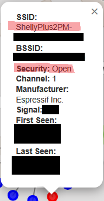
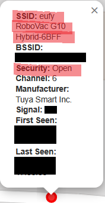
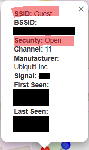
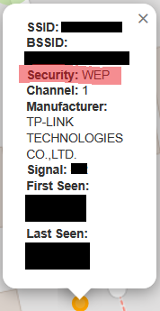

# Wardriving-Wireless-Security-Analysis

## 📌 Project Overview

This project analyzes Wi-Fi networks collected via wardriving using Kismet, with a strong focus on ethical data handling and anonymization.
The goal is to demonstrate practical skills in wireless security assessment, data anonymization, Python scripting, and visualization, suitable for IT Security / SOC Analyst roles.

All collected data is anonymized before analysis and no raw or identifying data is published.

### 📽️ Demo


### Live Map
👉 https://xxxxxx/

### 🗺️ Map Legend & Interpretation

- Each point represents an aggregated detection area, not an exact location
- Colors indicate dominant security type in the area:
  - Red: Open
  - Yellow: WEP
  - Blue: WPA2
  - Green: WPA3
- Locations are intentionally imprecise to protect privacy

## 🎯 Objectives

- Collect Wi-Fi metadata using Kismet during wardriving
- Anonymize all sensitive identifiers (SSID, BSSID, manufacturer, signal strength)
- Visualize anonymized data on an interactive map
- Summarize Wi-Fi security posture in the scanned area
- Follow ethical, legal, and responsible disclosure principles

## 🚧 Limitations & Non-Goals

- This project does NOT attempt to:
  - Identify individual networks or owners
  - Track devices over time
  - Perform intrusion or exploitation
- GPS accuracy is intentionally reduced
- Results reflect a limited geographic and temporal sample
- Security posture observations should not be generalized beyond the scanned area

## 🎓 Why This Project

This project was built to demonstrate:
- Understanding of wireless security fundamentals
- Ethical handling of sensitive data
- Python-based data processing
- Visualization of security-relevant information
- Awareness of privacy, legal, and ethical boundaries

It is intended as a learning and portfolio project, not a commercial tool.


## 🧰 Tools & Technologies

- Kismet – Wi-Fi packet capture and wardriving
- Python 3
 -SQLite (Kismet .kismet database format)
- Folium / Leaflet.js – interactive mapping
- Hashing (SHA-256 + salt) for anonymization

## 📋 Prerequisites
### Hardware Requirements

- WiFi USB dongle capable of being set to Monitor mode (Important!)
- GPS Module, cheapest are USB modules
- Laptop or other device capable of running Kismet

### Software Reqauirements
- Python 3.10+
- pandas, folium
- Kismet (.kismet SQLite database)
- Web browser

## 🔐 Data Anonymization & Ethics

This project does not publish raw wardriving data.

The following steps are applied before any analysis:

- SSIDs are hashed using SHA-256 with a random user-defined salt
- BSSIDs (MAC addresses) are hashed
- GPS coordinates are rounded (to the third decimal)
- Signal strength is removed
- Manufacturers are replaced with fictional company names
- Timestamps are removed

⚠️ Raw Kismet capture files are intentionally excluded from this repository.

## 📊 Scan Results and Analysis


Key Observations

- The majority of networks use WPA2, indicating reasonable but aging security
- WPA3 adoption is still low
- A notable percentage of open networks, including IoT devices
- Legacy protocols (WEP) are rare but still present

## 🔓 Why Open and WEP Networks Matter

Open and WEP-secured networks represent high-risk wireless environments.

### Open networks
- No encryption → traffic can be captured and read in cleartext
- Susceptible to man-in-the-middle attacks, rogue APs, and session hijacking

Often used by:

- IoT devices
- Guest networks
- Misconfigured home routers

- ## 📸 Example Devices Observed (Anonymized)

The following screenshots show anonymized examples of some weakly configured IoT devices
I picked up on kismet during the wardriving scan. These are included for illustrative
purposes only and do not identify specific devices, locations, or owners.

### 🏠 Consumer IoT Device (Example)




This example illustrates a consumer IoT device broadcasting a network
with weak or legacy security settings. Such devices are commonly deployed
with default configurations and may remain unpatched for long periods.

### 🤖 Robotic Vacuum Device (Example)



Robotic vacuum cleaners often rely on Wi-Fi connectivity for cloud-based
control and telemetry. When secured improperly, these devices can introduce
additional risk into home networks due to their persistent connectivity
and limited security controls.


### 🏠 Open Guest Networks (Example)



This screenshots shows an openly accessible guest network that was picked upduring the scan. Anyone can connect and inspect all unencrypted datat traffic with packet analysis.

### WEP networks

Cryptographically broken for years
Keys can be cracked in minutes using publicly available tools

Presence of WEP indicates:
- Legacy devices
- Poor security awareness
- Unmaintained infrastructure

Why this matters from a defensive perspective
- These networks are easy entry points for attackers
- Devices connected to them can be pivot points into better-secured networks
 -Their presence often correlates with broader security hygiene issues



## 🔐 Why WPA3 Adoption Is Relevant

WPA3 is currently the strongest widely available Wi-Fi security standard.

Key improvements over WPA2:

- Protection against offline password cracking
- Forward secrecy (past traffic stays protected even if the password leaks)
- Better security for weak passwords
- Mandatory encryption, even on “open” WPA3 networks (OWE)

Why low WPA3 adoption matters

- Indicates slow security modernization
- Shows reliance on legacy routers and firmware
- Suggests exposure to attacks that WPA3 explicitly mitigates
- From a security assessment standpoint:
- WPA3 adoption is a proxy metric for how seriously security updates are taken
- Low adoption increases long-term risk, even if WPA2 is still technically secure

## 🧠 Lessons Learned & Challenges

Working on this project for the first time presented several obstacles that required troubleshooting and careful problem-solving. Here is a summary of the main challenges and lessons learned:

### Wi-Fi Adapter Compatibility
My initial USB Wi-Fi adapter (Realtek chipset) was not compatible with monitor mode on Linux. Even though I could put it into monitor mode manually, Kismet either failed to detect networks or the adapter would freeze after multiple attempts. After researching online, I discovered that Realtek adapters often struggle with monitor mode on Linux.  
**Solution & Lesson Learned:** I purchased an Atheros AR9271 USB adapter, which worked flawlessly without additional drivers. I learned the importance of selecting hardware that is fully compatible with your tools and OS, saving time and reducing frustration.

### GPSD Coordinates Not Updating
Although I could initially get a GPS signal from my USB GPS module, the coordinates did not update while moving. Testing with `cgps` confirmed the module was detected, but GPSD was not feeding live data to Kismet. After research, I identified multiple contributing factors on Parrot OS:
- AppArmor was blocking GPSD from accessing the USB device (`/dev/ttyACM0`).  
- Network Manager interfered with the GPSD socket.  
- My user did not have sufficient permissions to access USB devices.  

**Solution & Lesson Learned:** I temporarily disabled AppArmor and Network Manager, added my user to the `dialout` group, and started GPSD manually pointing to the correct USB device. After this, Kismet successfully received live GPS coordinates.  
From this experience, I gained practical skills in Linux system administration, service troubleshooting, and understanding OS-specific security restrictions.


## 🛠️ Environment Setup & Map Generation (Windows 11)

This guide explains how the Python environment was set up on Windows 11 to process Kismet data and generate the interactive map.
Although I scanned the networks using Parrot OS (Linux), I later transferred the .kismet scan results to my windows machine where I did all the scripting and map generation etc. I will give a short summary below of how I set up up my windows to enable python scripting and map generation:

### 1. Navigate to the official Python website
- https://www.python.org/downloads/windows/.
- Download the latest Python version and run the installer.
- In the installer, check 'Add Python to path'.
- Open Powershell and confirm the Python installation:

```
python --version
pip --version
```

### 2. Install the required python libraries for this project:

```
pip install pandas folium
```
 - Verify:
   
```
python -c "import pandas, folium; print('Libraries installed successfully')"
```

### 3. Create the 1st python anonymization script:

> [!NOTE]
> If you are going to create a map straight from the raw data with no anonymization, skip to step 5.

  - Create a new file and name it appropriately e.g.: anonymize_kismet_data.py
  -  Pull or add the data anonymization script under /scripts in this repo.
  
> [!IMPORTANT]
> Make sure the file extension is .py if creating the file manually.

### 4. Run the script
   
  - From Powershell in the folder (hold shift and right-click in the folder with the python script -> then run Powershell
```
python scripts\kismet_to_map.py
```

### 5. Create the 2nd python folium map generation script:
   
  - Create a new file and name it appropriately e.g.: anonymize_kismet_data.py
  - Pull or add the map generation script under /scripts in this repo.

### 6. Run the script
   
  - From Powershell in the folder (hold shift and right-click in the folder with the python script -> then run Powershell
```
python scripts\generate_folium_map_anonymized.py
```

  - This will output a file named: wifi_security_map.html in the same folder. Opening this with your browser shows you the folium map!

### 7. Create the 3rd python script to summarize the scan data

  - Create a new file and name it appropriately e.g.: summarize_wifi_security.py
  - Pull or add the map generation script under /scripts in this repo.

### 8. Run the script
   
  - From Powershell in the folder (hold shift and right-click in the folder with the python script -> then run Powershell
```
python scripts\summarize_wifi_security.py
```

